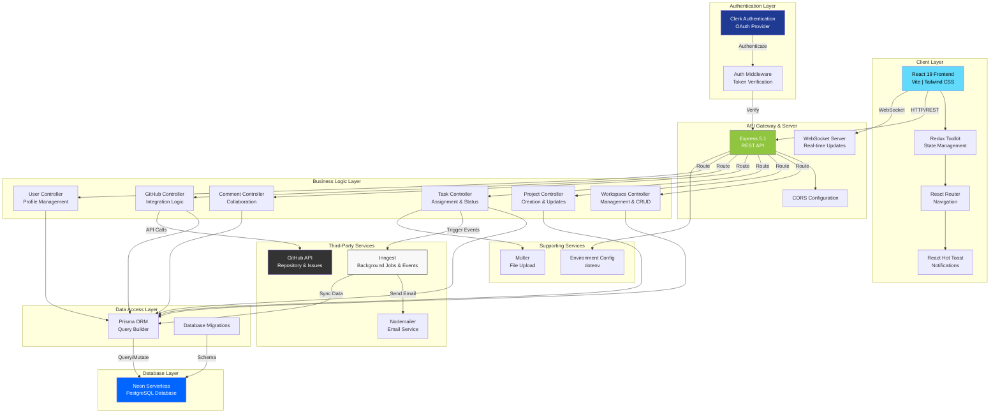
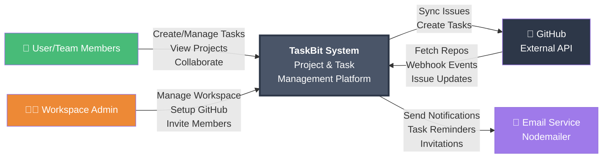
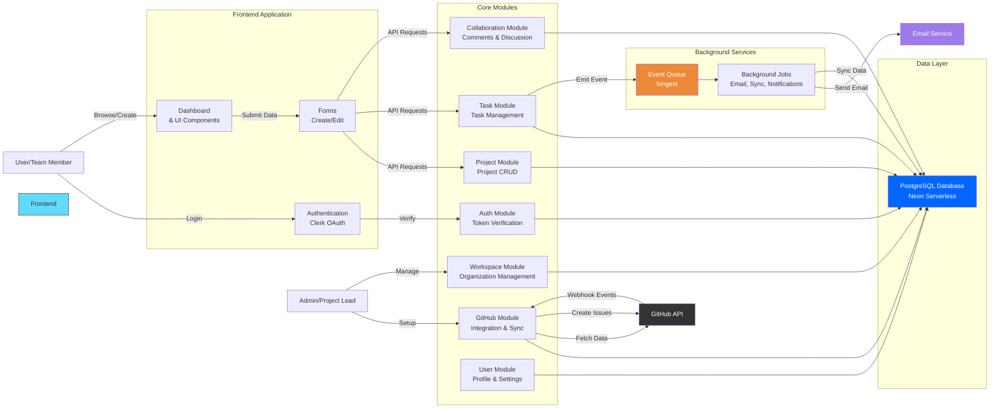
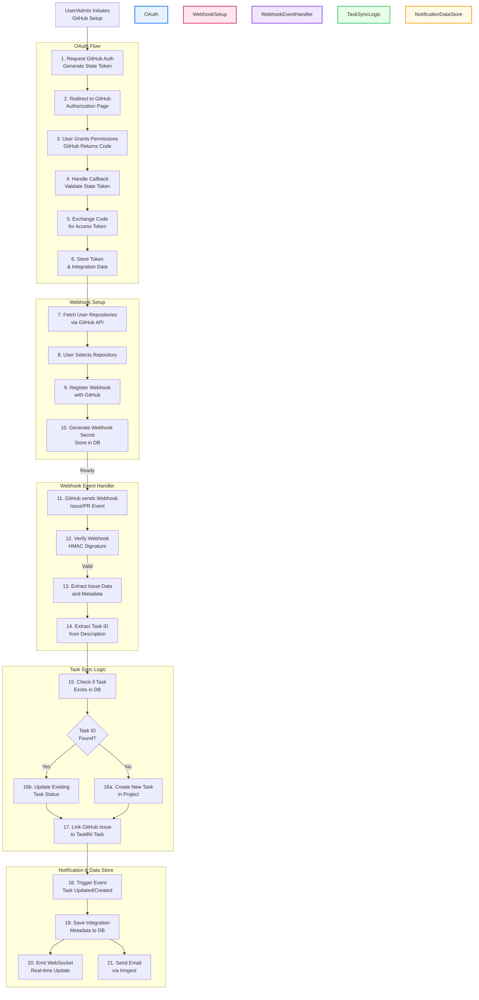

# TaskBit - Technical Documentation Suite

## Overview
TaskBit is a modern project management and task tracking application with GitHub integration capabilities. This document provides comprehensive architectural and data flow documentation using Mermaid diagrams.

---

## 1. System Architecture Diagram



---

## 2. Entity Relationship Diagram (ERD)

```mermaid
erDiagram
    USER ||--o{ WORKSPACE : "owns"
    USER ||--o{ WORKSPACEMEMBER : "joins"
    WORKSPACE ||--o{ WORKSPACEMEMBER : "contains"
    WORKSPACE ||--o{ PROJECT : "contains"
    USER ||--o{ PROJECT : "leads"
    USER ||--o{ PROJECTMEMBER : "joins"
    PROJECT ||--o{ PROJECTMEMBER : "contains"
    PROJECT ||--o{ TASK : "contains"
    USER ||--o{ TASK : "assigns"
    USER ||--o{ COMMENT : "writes"
    TASK ||--o{ COMMENT : "has"
    PROJECT ||--o| PROJECTGITHUBINTEGRATION : "has"
    PROJECTGITHUBINTEGRATION ||--o{ GITHUBOAUTHSTATE : "generates"

    USER {
        string id PK
        string name
        string email UK
        string image
        string designation
        string department
        string about
        datetime createdAt
        datetime updatedAt
    }

    WORKSPACE {
        string id PK
        string name
        string slug UK
        string description
        json settings
        string ownerId FK
        string image_url
        datetime createdAt
        datetime updatedAt
    }

    WORKSPACEMEMBER {
        string id PK
        string userId FK
        string workspaceId FK
        string message
        enum role "ADMIN, MEMBER"
        unique "userId, workspaceId"
    }

    PROJECT {
        string id PK
        string name
        string description
        enum priority "LOW, MEDIUM, HIGH"
        enum status "ACTIVE, PLANNING, COMPLETED, ON_HOLD, CANCELLED"
        datetime start_date
        datetime end_date
        string team_lead FK
        string workspaceId FK
        int progress
        datetime createdAt
        datetime updatedAt
    }

    PROJECTMEMBER {
        string id PK
        string userId FK
        string projectId FK
        unique "userId, projectId"
    }

    TASK {
        string id PK
        string projectId FK
        string title
        string description
        enum status "TODO, IN_PROGRESS, DONE"
        enum type "TASK, BUG, FEATURE, IMPROVEMENT, OTHER"
        enum priority "LOW, MEDIUM, HIGH"
        string assigneeId FK
        datetime due_date
        int githubIssueNumber
        string githubIssueUrl
        string githubRepository
        datetime createdAt
        datetime updatedAt
    }

    COMMENT {
        string id PK
        string content
        string userId FK
        string taskId FK
        datetime createdAt
    }

    PROJECTGITHUBINTEGRATION {
        string id PK
        string projectId FK UK
        string githubAccountLogin
        string githubUserId
        string repository
        string accessToken
        string webhookSecret
        datetime webhookSecretUpdatedAt
        datetime createdAt
        datetime updatedAt
    }

    GITHUBOAUTHSTATE {
        string id PK
        string state UK
        string userId
        string projectId
        string integrationId FK
        datetime expiresAt
        datetime createdAt
    }
```

---

## 3. Data Flow Diagram - Level 0 (Context)



---

## 4. Data Flow Diagram - Level 1 (Functional)



---

## 5. Data Flow Diagram - Level 2 (Detailed: GitHub Integration + Project Management)



---

## Key Components Reference

### Frontend Routes (React Router)
- `/` - Dashboard
- `/team` - Team Management
- `/projects` - Projects List
- `/projectsDetail` - Project Details & Tasks
- `/taskDetails` - Task Details & Comments
- `/github/callback` - GitHub OAuth Callback Handler

### Backend API Endpoints
- `POST/GET/PUT/DELETE /api/workspaces` - Workspace CRUD
- `POST/GET/PUT/DELETE /api/projects` - Project CRUD
- `POST/GET/PUT/DELETE /api/tasks` - Task CRUD
- `POST/GET/PUT/DELETE /api/comments` - Comments
- `GET/POST /api/github/*` - GitHub Integration
- `POST /api/github/webhook/:projectId` - GitHub Webhooks (Raw Body)
- `GET/PUT /api/users` - User Profile

### Background Jobs (Inngest)
1. `sync-user-from-clerk` - Sync new user creation
2. `delete-user-with-clerk` - Sync user deletion
3. `update-user-from-clerk` - Sync user updates
4. `sync-workspace-from-clerk` - Sync workspace creation
5. `update-workspace-from-clerk` - Sync workspace updates
6. `delete-workspace-with-clerk` - Sync workspace deletion
7. `sync-workspace-member-from-clerk` - Sync member invitations
8. `send-task-assignment-mail` - Email + Reminder workflow

### Technology Stack Summary

| Layer | Technology |
|-------|-----------|
| **Frontend** | React 19, Vite, Redux Toolkit, Tailwind CSS, Axios |
| **Backend** | Express 5.1, Node.js |
| **Database** | PostgreSQL (Neon Serverless) |
| **ORM** | Prisma 6.17 |
| **Authentication** | Clerk (OAuth) |
| **Real-time** | WebSocket (ws) |
| **Background Jobs** | Inngest |
| **Email** | Nodemailer |
| **File Upload** | Multer |
| **External APIs** | GitHub API v2022-11-28 |
| **UI Components** | Lucide React, Recharts |
| **Deployment** | Vercel (Client & Server) |

### Enums & Constants

**Task Status**: TODO, IN_PROGRESS, DONE

**Task Type**: TASK, BUG, FEATURE, IMPROVEMENT, OTHER

**Priority**: LOW, MEDIUM, HIGH

**Project Status**: ACTIVE, PLANNING, COMPLETED, ON_HOLD, CANCELLED

**Workspace Role**: ADMIN, MEMBER

---

## Architecture Highlights

1. **Microservices-Ready**: Modular structure with separate concerns (Auth, Projects, Tasks, GitHub)
2. **Event-Driven**: Uses Inngest for asynchronous task processing and event handling
3. **Real-time Capabilities**: WebSocket integration for live updates
4. **OAuth-First Auth**: Clerk provides enterprise-grade authentication
5. **Serverless Database**: Neon provides scalable PostgreSQL
6. **GitHub-First Integration**: Deep GitHub integration with webhooks and OAuth
7. **Email Automation**: Inngest-driven email notifications with reminders
8. **Type Safety**: Prisma ensures type-safe database operations
9. **API Gateway Pattern**: Express serves as the API gateway
10. **State Management**: Redux Toolkit for predictable client-side state

---

## Data Flow Summary

1. **User Authentication** → Clerk OAuth → Session Token
2. **Create Project** → API Request → Prisma Query → PostgreSQL → Emit Event
3. **Assign Task** → Task Controller → Trigger Inngest Event → Email + Notification
4. **GitHub Integration Setup** → OAuth Flow → Store Credentials → Register Webhook
5. **GitHub Webhook Event** → Verify Signature → Extract Data → Create/Update Task → Notify User
6. **Real-time Updates** → WebSocket → Redux Update → UI Re-render

---

## Security Considerations

- ✅ CORS enabled for cross-origin requests
- ✅ Clerk middleware for authentication verification
- ✅ GitHub webhook signature verification (HMAC)
- ✅ Role-based access control (ADMIN/MEMBER)
- ✅ Project-level permission checks
- ✅ Environment variable configuration (no hardcoded secrets)
- ✅ Prisma prevents SQL injection via parameterized queries
- ✅ OAuth tokens stored securely

---

*Documentation Generated: 2026-04-23*
*TaskBit - Modern Project Management Platform*
